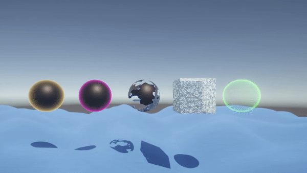

# Unity - ShaderGraph

## Learning objectives

- What is rendering
- What is a render pipeline
- What is Unity’s Scriptable Render Pipeline
- What is a shader
- What is ShaderGraph and how is it used
- How to setup a new project that utilizes ShaderGraph
- What is the difference between surface, vertex and fragment shaders
- What is UV mapping
- What is vertex animation

 

## All shaders in this project

> In this gif, we can see some shader effects (In order):
> - Glowing
> - Glowing with some pulse
> - Dissolving / Disintegrating
> - Ice
> - Hologram
> - Waves
